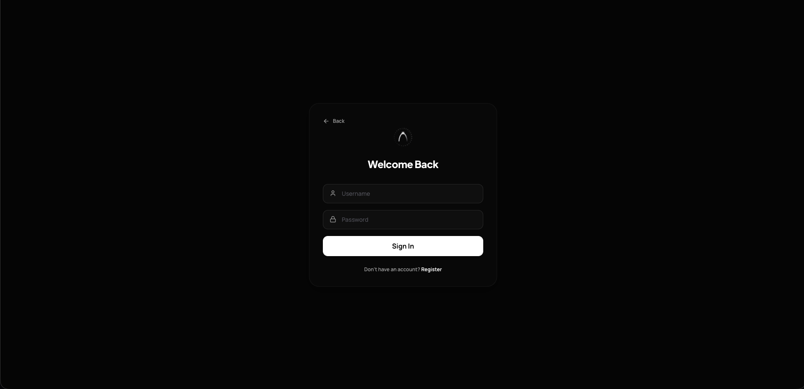
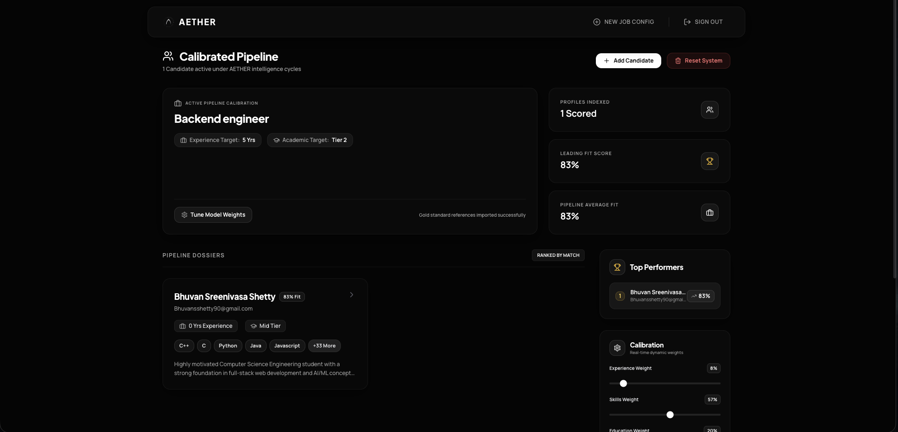

<p align="center">
  
</p>

<h1 align="center">AETHER - AI-Powered Recruitment System</h1>

<p align="center">
  <strong>A hybrid AI recruitment intelligence platform that combines Gemini-powered resume parsing with adaptive ML-based candidate scoring and explainable analytics.</strong>
</p>

<p align="center">
  
  
  
  
</p>

---

## Table of Contents

1. [Problem Statement](#problem-statement)
2. [Our Solution](#our-solution)
3. [System Architecture](#system-architecture)
4. [Scoring Model - How It Works](#scoring-model---how-it-works)
5. [Tech Stack](#tech-stack)
6. [Project Structure](#project-structure)
7. [Features](#features)
8. [API Reference](#api-reference)
9. [Getting Started](#getting-started)
10. [Environment Variables](#environment-variables)
11. [Screenshots and UI Flow](#screenshots-and-ui-flow)
12. [Team](#team)

---

## Problem Statement

Recruitment teams face:

- Manual resume screening that slows hiring
- Inconsistent scoring and bias across reviewers
- Limited visibility into why a candidate is ranked higher or lower
- Difficulty tuning evaluation criteria across different roles

Result: Slow pipelines, noisy shortlists, and weak hiring insights.

---

## Our Solution

AETHER combines a modern MERN stack with Gemini-powered extraction and a dedicated ML scoring service to deliver:

| Principle | How AETHER Implements It |
|---|---|
| Automation | Resume PDF parsing and structured candidate extraction through a Gemini-based pipeline |
| Consistency | Configurable weighted scoring for experience, skills, and education |
| Transparency | Score breakdowns and chart-based visual analytics |
| Continuous Learning | Fine-tuning weights based on HR ratings |

AETHER is a hybrid AI recruitment intelligence platform that combines Gemini-powered resume parsing with adaptive ML-based candidate scoring. The platform extracts structured candidate profiles from resumes, evaluates applicants through configurable weighted scoring pipelines, and continuously improves recruiter alignment through feedback-driven learning models.

---

## System Architecture


<p align="center">
  
</p>

---

## Scoring Model - How It Works

Workflow (end-to-end):

1. Resume Upload
2. PDF Text Extraction
3. Gemini NLP Parsing
4. Structured Candidate Features
5. Weighted Scoring Engine
6. Candidate Ranking
7. Recruiter Feedback
8. Adaptive Weight Optimization

### Step 1: Candidate Feature Extraction

Candidate profiles are built from parsed resumes:

- years_exp
- skill_score
- education_tier
- prev_companies_tier (defaulted)

### Step 2: Weighted Scoring

The ML service computes component scores (0-100) and applies weights:

```
final_score = (exp * w_exp + skills * w_skill + edu * w_edu + prev * w_prev) / total_weight
```

### Step 3: Explainability and Visualization

- Returns a score breakdown and summary analysis
- Generates a radar chart comparing candidate vs benchmark averages

### Step 4: Fine-Tuning

When enough HR ratings are collected, the service fits a linear model to
learn improved weights while keeping the prevCompany weight fixed.

---

## Tech Stack

### Backend
| Technology | Purpose |
|---|---|
| Node.js 18 | Runtime |
| Express 5 | REST API framework |
| MongoDB + Mongoose 9 | Database and ODM |
| jsonwebtoken | JWT authentication |
| bcryptjs | Password hashing |
| multer + pdf-parse | Resume upload and text extraction |
| Axios | ML service bridge |
| @google/generative-ai | Gemini resume parsing |

### Frontend
| Technology | Purpose |
|---|---|
| React 18 | UI framework |
| Vite 5 | Build tool and dev server |
| React Router | Client-side routing |
| Tailwind CSS | Styling |
| Axios | API calls |
| Lucide React | Icon system |

### ML Service
| Technology | Purpose |
|---|---|
| Python 3.13 | Runtime |
| FastAPI | ML microservice |
| scikit-learn | Model fitting for weight tuning |
| NumPy, Pandas | Data processing |
| Matplotlib | Radar chart generation |

---

## Project Structure

```
AETHER/
├── Backend/                 # Node.js/Express API
│   ├── app.js
│   ├── config/
│   ├── controllers/
│   ├── middleware/
│   ├── models/
│   ├── routes/
│   ├── services/
│   └── utils/
├── Frontend/                # React + Vite client
│   ├── index.html
│   ├── src/
│   └── tailwind.config.js
├── ml/                      # FastAPI ML service
│   ├── app.py
│   ├── model/
│   └── requirements.txt
└── README.md
```

---

## Features

### Recruiter Experience
- Resume upload and AI parsing
- Configurable job setup with weighted scoring
- Candidate leaderboard and detail view
- Visual analytics and radar chart insights

### ML and AI
- Weighted scoring with benchmarks
- Gemini-powered resume parsing and structured capability profiles
- Fine-tuning weights based on HR ratings
- Explainable scoring summaries

### Security
- JWT authentication
- Encrypted Gemini API key storage

---

## API Reference

### Auth
| Method | Endpoint | Auth | Description |
|--------|----------|------|-------------|
| `POST` | `/api/auth/register` | Public | Register a user |
| `POST` | `/api/auth/login` | Public | Login and receive JWT |
| `GET` | `/api/auth/me` | JWT | Fetch current user |

### Job Configuration
| Method | Endpoint | Auth | Description |
|--------|----------|------|-------------|
| `POST` | `/api/job-config` | JWT | Create job configuration |
| `GET` | `/api/job-config/active` | JWT | Get active job configuration |
| `PUT` | `/api/job-config/active` | JWT | Update weights and filters |

### Candidates
| Method | Endpoint | Auth | Description |
|--------|----------|------|-------------|
| `POST` | `/api/candidates/upload` | JWT | Upload and parse resume |
| `POST` | `/api/candidates/:id/predict` | JWT | Predict candidate score |
| `POST` | `/api/candidates/:id/rate` | JWT | Submit HR rating |
| `GET` | `/api/candidates` | JWT | List candidates |
| `GET` | `/api/candidates/:id` | JWT | Get candidate by id |
| `DELETE` | `/api/candidates/:id` | JWT | Delete candidate |

### User
| Method | Endpoint | Auth | Description |
|--------|----------|------|-------------|
| `POST` | `/api/user/setup-key` | JWT | Save Gemini API key |
| `DELETE` | `/api/user/reset-job` | JWT | Reset job data |
| `GET` | `/api/user/top-candidates` | JWT | Leaderboard |

### ML Service
| Method | Endpoint | Description |
|--------|----------|-------------|
| `POST` | `/predict` | Predict score + chart |
| `POST` | `/fine_tune` | Learn updated weights |

---

## Getting Started

### Prerequisites
- Node.js 18+
- Python 3.13+
- MongoDB (local or Atlas)

### 1. Backend
```bash
cd Backend
npm install
npm run start
```

### 2. Frontend
```bash
cd Frontend
npm install
npm run dev
```

### 3. ML Service
```bash
cd ml
python -m venv venv
source venv/bin/activate
pip install -r requirements.txt
python app.py
```

---

## Environment Variables

Create a `.env` file in `Backend/`:

```env
PORT=5050
MONGO_URI=your_mongodb_connection_string
JWT_SECRET=your_jwt_secret
GEMINI_API_KEY=your_google_gemini_key
ML_SERVICE_URL=http://localhost:8000
ENCRYPTION_KEY=32_characters_long_key_here
```

---

## Screenshots and UI Flow

Screenshots are stored in `Assets/` and referenced below.

<p align="center">
  
</p>

<p align="center">
  
</p>

---


<p align="center">
  <strong>Built for faster, fairer, and more explainable hiring.</strong>
</p>
